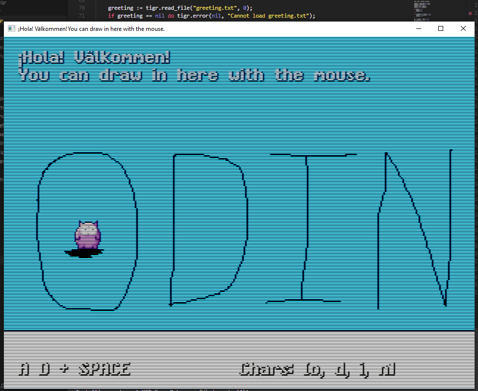

# README

TIGR is a tiny graphics library, for when you just need to draw something in a window without any fuss. TIGR doesn't want to do everything. We don't want to bloat your program with hundreds of extra DLLs and megabytes of frameworks.

We don't want to supply every possible function you might ever need. There are already plenty of add-on libraries for doing sound, XML, 3D, whatever. Our goal is simply to allow you to easily throw together small 2D programs when you need them.

TIGR's core is a simple framebuffer library. On top of that, we provide a few helpers for the common tasks that 2D programs generally need:

 - Create bitmap windows.
 - Direct access to bitmaps, no locking.
 - Basic drawing helpers (plot, line, blitter).
 - Text output.
 - PNG loading and saving.

TIGR is designed to be small and independent. A typical 'hello world' is less than 40KB. We don't require you to distribute any additional DLLs; everything is baked right into your program.